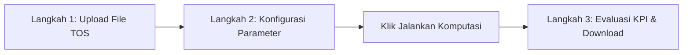

# 🚢 CACA - Cycle Analyst & Cargo Accelaration
### Dashboard Analisis Rekonstruksi Dual Cycle & Twin Lift Kontainer
**PT Pelindo Terminal Teluk Lamong (TTL) — Proyek Inovasi Kelompok Magang**


---

## 📌 1. Tujuan & Latar Belakang

### Latar Belakang
**PT Terminal Teluk Lamong (TTL)** merupakan terminal ramah lingkungan (*Green Port*) modern pertama di Indonesia yang mengoperasikan *Automated Stacking Cranes* (ASC) dan *Ship-to-Shore* (STS) Cranes berteknologi tinggi. Dalam operasional bongkar muat (*discharge* dan *load*) peti kemas, produktivitas terminal diukur dari kecepatan dan efisiensi pergerakan kontainer antara dermaga (*quay*) dan lapangan penumpukan (*container yard / CY*).

Dua pilar utama optimasi produktivitas alat di terminal adalah:
1. **Dual Cycle**: Mekanisme di mana truk pengangkut kontainer (*Internal Transfer Vehicle / Combined Terminal Tractor*) melakukan pengangkutan muatan dua arah dalam satu siklus perjalanan (membawa kontainer *discharge* dari dermaga ke lapangan, lalu langsung mengangkut kontainer *load* dari lapangan kembali ke dermaga tanpa perjalanan kosong/*empty trip*).
2. **Twin Lift**: Kemampuan spreader crane untuk mengangkat sekaligus dua kontainer ukuran 20 kaki (*twenty-foot equivalent unit*) dalam satu kali gerakan angkat (*single lift movement*), baik saat proses bongkar maupun muat kapal.

### Masalah yang Dihadapi
Sebelum dashboard ini dikembangkan, evaluasi rasio ketercapaian Dual Cycle dan utilisasi Twin Lift di Pelindo TTL dihitung secara semi-manual menggunakan **Macro Excel VBA**. Pendekatan lama ini memiliki sejumlah kelemahan krusial:
- **Keterbatasan Performa**: Macro VBA sering mengalami *freeze* atau *crash* saat memproses data log operasional TOS (*Terminal Operating System*) berukuran besar (puluhan hingga ratusan ribu baris).
- **Kurangnya Aksesibilitas Eksekutif**: Hasil VBA hanya berupa lembar spreadsheet angka statis tanpa visualisasi interaktif, tren historis bulanan, maupun filter analitik per kapal (*per vessel*).
- **Ketergantungan Perangkat**: File spreadsheet dengan macro rentan rusak (*corrupted*), memiliki masalah kompatibilitas versi Office, dan tidak dapat diakses secara kolaboratif multi-user via web browser.

### Tujuan Dashboard CACA
Aplikasi **CACA** dibangun untuk:
1. **Mengotomatisasi Rekonstruksi Siklus**: Menggantikan macro VBA dengan mesin komputasi Python berkecepatan tinggi yang 100% konsisten dan terkalibrasi dengan rumus historis Pelindo TTL.
2. **Menyajikan Executive KPI Interaktif**: Menyediakan dasbor visual elegan bertema maritim modern untuk jajaran manajemen dan tim operasional dermaga.
3. **Mengevaluasi Efisiensi Nyata**: Mengukur rasio Dual Cycle, tingkat keberhasilan Twin Lift, penghematan ritase truk (*truck trips saved*), dan kontribusi terhadap reduksi emisi karbon operasional secara instan.

---

## 🚀 2. Cara Pengoperasian Website

Dashboard dirancang dengan pendekatan alur kerja 3 langkah linier yang intuitif:



### **Langkah 1: Upload File Data Operasional**
1. Pada kartu **Langkah 1**, klik tombol **"Upload File"**.
2. Unggah file log aktivitas kontainer dari sistem TOS dermaga atau VBS (khusus format `.xlsx` dengan ukuran hingga 200 MB).
3. Sistem secara otomatis membaca seluruh sheet, memvalidasi keberadaan kolom wajib, dan menampilkan nama file terpilih.

### **Langkah 2: Parameter Ambang Batas & Kriteria Analisis**
1. **Pilih Sheet**: Pilih sheet yang memuat data operasional (jika file berupa workbook multi-sheet).
2. **Sesuaikan Ambang Batas (Thresholds)**:
   - **Ambang Combo (menit)** *(Default: 40 menit)*: Toleransi selisih waktu maksimum antara 2 baris kontainer 20ft untuk dianggap sebagai satu muatan truk bersamaan.
   - **Ambang Dual Cycle (menit)** *(Default: 240 menit / 4 jam)*: Selisih waktu maksimal antara aktivitas *DISC* dan *LOAD* pada truk yang sama untuk diakui sebagai siklus ganda.
   - **Ambang Twinlift (menit)** *(Default: 1 menit)*: Selisih waktu angkat *DISC_LOAD_TS* antara dua kontainer 20ft di kapal yang sama untuk diklasifikasikan sebagai pengangkatan ganda oleh crane.
3. **Jalankan Komputasi**:
   - Klik tombol **"Jalankan Komputasi Analisis"**.
   - Sistem akan mengeksekusi algoritma multi-layer secara asinkron dalam hitungan detik.
   - Halaman akan **otomatis bergeser mulus (*smooth auto-scroll*)** ke bagian Langkah 3.

### **Langkah 3: Executive KPI & Evaluasi Interaktif**
Hasil langsung disajikan ke dalam kartu KPI utama dan 4 tab analitik terdedikasi:
- **Kartu Ringkasan KPI**: Menampilkan Total Kontainer, Rasio Dual Cycle (%), Utilisasi Twin Lift (%), dan Total Ritase Truk Terbentuk.
- **Tab 1 — Dual Cycle**: Diagram donat persentase siklus, grafik batang perbandingan kontainer, dan grafik tren bulanan efisiensi siklus ganda.
- **Tab 2 — Twin Lift**: Distribusi kontainer Twin Lift vs Single Lift serta tren utilisasi crane bulanan.
- **Tab 3 — Per Vessel**: Dropdown pemilihan kapal (*VES_ID*) untuk membedah kinerja alat per kunjungan kapal sandar.
- **Tab 4 — Download Hasil Analisis**: Pratinjau tabel hasil rekonstruksi (menampilkan 1.000 baris pertama) serta tombol unduh dataset lengkap berformat **Excel (`.xlsx`)**.

---

## 🛠️ 3. Teknologi & Pustaka yang Digunakan (Tech Stack)

Aplikasi dibangun dengan tumpukan teknologi modern berkinerja tinggi:

| Lapisan / Komponen | Teknologi | Keterangan & Peran |
| :--- | :--- | :--- |
| **Bahasa Pemrograman** | **Python 3.10+ / 3.12** | Logika inti komputasi data dan server backend |
| **Web Framework** | **Streamlit 1.44.1** | Antarmuka web reaktif, manajemen sesi (`session_state`), dan deployment cloud |
| **Pengolahan Data** | **Pandas 2.0+ & NumPy 1.24+** | Vektorisasi DataFrame, sliding window matching, dan transformasi waktu |
| **Visualisasi Interaktif** | **Plotly Express & Graph Objects** | Grafik donat, bar chart komparatif, dan time series bertema *dark glassmorphism* |
| **Manipulasi Excel** | **OpenPyXL 3.1+** | Pembacaan dan pembuatan file spreadsheet hasil analisis berkecepatan tinggi |
| **Templating Engine** | **Jinja2 3.1+** | Rendering kartu HTML modular dinamis dari folder `templates/` |
| **Styling & Tampilan** | **CSS3 & Glassmorphism** | Tata letak *full-bleed*, transisi *smooth scroll*, aksen neon maritim di `assets/style.css` |
| **Tipografi** | **Google Fonts** | `Plus Jakarta Sans` (body text & metrik KPI) dan `Anton` (aksen identitas CACA) |

---

## 🧠 4. Logika & Algoritma Komputasi (Under the Hood)

Algoritma komputasi di [modules/calculations.py](modules/calculations.py) mereplikasi logika macro VBA Pelindo TTL dengan optimasi komputasi vektor berbasis memori (*vectorized memory computing*):

```mermaid
flowchart TD
    Raw[Log Data TOS Mentah] --> Clean[Normalisasi & Pembersihan Data]
    Clean --> Layer1[Layer 1: Deteksi Combo 20ft\nSliding Window O(m log m)]
    Layer1 --> Layer1b[Layer 1b: Deteksi Twin Lift\nValidasi Kapal & Delta Waktu DISC/LOAD]
    Layer1 --> EventFormation[Pembentukan Event Ritase Truk]
    EventFormation --> Layer2[Layer 2: Deteksi Dual Cycle\nGreedy Matching Lintas DISC vs LOAD]
    Layer2 --> Metrics[Kalkulasi KPI & Ringkasan Metrik]
```

### 1. Normalisasi Data & Replikasi Fungsi `Val()` VBA
- Data ukuran kontainer di TOS sering berformat string (contoh: `'20FT'`, `'40'`, `'45HC'`). Fungsi `vba_val()` mengekstrak digit angka di awal teks menggunakan ekspresi reguler `^\s*[+-]?\d+`.
- Kolom timestamp `DISC_LOAD_TS` (waktu di dermaga) dan `STACK_UNSTACK_TS` (waktu di lapangan) diparsing dengan penanganan *fallback*. Jika keduanya kosong, sistem menandainya dengan tanggal historis dummy `1899-12-29` (persis sesuai standar kalibrasi VBA agar total baris data tidak terdistorsi).

### 2. Layer 1 — Deteksi Muatan Combo 20ft
- Truk terminal dapat mengangkut **dua kontainer 20ft sekaligus** dalam satu chasis (*Combo*).
- Dikelompokkan per ID Truk (`CAR_CHE_ID`) dan jenis aktivitas (`LOAD` atau `DISC`).
- Algoritma pencocokan menggunakan **Sliding Window Greedy** $O(m \log m)$ berdasarkan selisih waktu minimum $\min(\Delta t_{\text{dermaga}}, \Delta t_{\text{lapangan}}) \le \text{ambang\_combo}$.
- Pasangan dengan selisih waktu terkecil diprioritaskan untuk digabungkan menjadi satu `GROUP_ID`.

### 3. Layer 1b — Deteksi Pengangkatan Twin Lift
- Kontainer yang telah membentuk pasangan Combo 20ft diuji kriteria Twin Lift oleh STS Crane:
  $$\text{Syarat: } (\text{Size}_1 = \text{Size}_2 = 20\text{ft}) \land (\text{VES\_ID}_1 = \text{VES\_ID}_2) \land (|t_{\text{disc\_load}, 2} - t_{\text{disc\_load}, 1}| \le \text{ambang\_twinlift})$$
- Jika selisih waktu angkat di dermaga $\le$ 1 menit dan berada pada kapal yang sama, maka diklasifikasikan sebagai **Twinlift**; jika tidak, berstatus **Bukan Twinlift**.

### 4. Pembentukan Event Ritase Truk
- Seluruh kontainer (baik Single 20ft/40ft maupun pasangan Combo 20ft) dikonversi menjadi entitas tunggal yang disebut **Event Ritase**.
- Waktu mulai (`START_TS`) dan waktu selesai (`END_TS`) ditentukan berdasarkan urutan logis pergerakan fisik truk:
  - Aktivitas `DISC`: Mulai di dermaga (`TS_G`) $\rightarrow$ Selesai di lapangan (`TS_H`).
  - Aktivitas `LOAD`: Mulai di lapangan (`TS_H`) $\rightarrow$ Selesai di dermaga (`TS_G`).

### 5. Layer 2 — Deteksi Dual Cycle Lintas Aktivitas
- Event ritase pada truk yang sama diurutkan secara kronologis berdasarkan `START_TS`.
- Dilakukan pencocokan berpasangan antara event berlawanan (`DISC` $\leftrightarrow$ `LOAD` atau `LOAD` $\leftrightarrow$ `DISC`) dengan selisih waktu transisi:
  $$\Delta t_{\text{transisi}} = |\text{START}_{B} - \text{END}_{A}| \le \text{ambang\_dual}$$
- Event yang berhasil dipasangkan ditandai sebagai **Dual Cycle**, sedangkan event yang berjalan searah tanpa muatan balasan ditandai sebagai **Non Dual** (Single Cycle).

---

## 🎨 5. Desain Antarmuka & Sistem UI (UI/UX System)

Desain dashboard mengadopsi estetika **Maritime Dark Glassmorphism** kelas eksekutif:

### A. Palet Warna (Color Palette)
- **Deep Maritime Base (`#070C18` / `#0B1329`)**: Warna latar gelap pekat berkesan kedalaman samudra yang nyaman untuk penggunaan jangka panjang di ruang kontrol (*Control Room*).
- **Glass Card Surface (`#0F172A` / `rgba(15, 23, 42, 0.75)`)**: Panel transparan semi-kaca dengan efek blur `backdrop-filter: blur(12px)` dan border tipis `rgba(255, 255, 255, 0.08)`.
- **Pelindo Blue Gradient (`#0284C7` $\rightarrow$ `#0369A1`)**: Warna primer khas Pelindo yang diterapkan pada badge nomor langkah (1, 2, dan 3), tombol eksekusi, serta header banner.
- **Electric Cyan (`#38BDF8`)**: Warna aksen untuk sorotan teks penting, persentase metrik, dan pill status ekspor.
- **Emerald Success (`#10B981`)**: Warna indikator pencapaian positif, status utilisasi tinggi, dan efisiensi optimal.
- **Muted Slate (`#94A3B8`)**: Warna teks deskripsi sekunder untuk menjaga hierarki keterbacaan yang seimbang.

### B. Tipografi (Typography)
- **Primary Body & Metrics**: [`Plus Jakarta Sans`](https://fonts.google.com/specimen/Plus+Jakarta+Sans) — Jenis huruf sans-serif modern dengan legibilitas tinggi untuk pembacaan angka-angka metrik analitik.
- **Branding Header**: [`Anton`](https://fonts.google.com/specimen/Anton) — Jenis huruf tegas, padat, dan kokoh yang merepresentasikan identitas logo dan ketangguhan alat berat pelabuhan.

### C. Keunggulan Interaksi Visual
- **Seamless Full-Bleed Layout**: Menghilangkan seluruh margin dan padding default Streamlit yang mengganggu sehingga dasbor terasa seperti aplikasi desktop/SaaS kustom mandiri.
- **Fluid Micro-Animations**: Efek *hover elevate*, transisi bayangan lembut, dan penanda tab aktif bergradien biru yang menyala lembut.
- **Smooth Auto-Scroll**: Pengalihan viewport otomatis yang mulus dari kontrol parameter Langkah 2 menuju hasil analitik Langkah 3 setelah komputasi selesai.

---

## 📈 6. Hasil & Dampak Bisnis (Business Impact)

Implementasi dashboard CACA memberikan dampak nyata bagi operasional **Pelindo Terminal Teluk Lamong**:

```text
=============================================================================
               DAMPAK EFISIENSI OPERASIONAL TERMINAL TELUK LAMONG
=============================================================================
  Metrik Evaluasi        Sebelum (Manual VBA)        Sesudah (Dashboard CACA)
-----------------------------------------------------------------------------
  Kecepatan Analisis     10 - 30 Menit (Sering Hang)  1 - 3 Detik (Real-Time)
  Aksesibilitas          Terbatas di 1 PC Offline    Multi-User Web Browser
  Visualisasi            Tabel Angka Statis          Grafik Interaktif & KPI
  Presisi Perhitungan    Tergantung Operator         100% Terkalibrasi Standar
  Dukungan Ekspor        Terkunci di Workbook Lama   Excel (.xlsx) Siap Lapor
=============================================================================
```

### 1. Peningkatan Produktivitas Alat (BCH / Box per Crane Hour)
Dengan memantau utilisasi **Twin Lift** secara harian dan per kapal, tim perencanaan (*stowage planner*) dapat mengevaluasi akurasi penempatan kontainer 20ft di bay kapal, meningkatkan frekuensi angkat ganda, dan secara langsung mendongkrak BCH crane STS.

### 2. Pengurangan Ritase Truk Kosong (*Trips Reduction*)
Setiap siklus yang berhasil diubah menjadi **Dual Cycle** memangkas satu perjalanan truk kosong dari dermaga ke lapangan penumpukan. Ini mengurangi kepadatan lalu lintas di dermaga (*quay congestion*) dan mempercepat *turnaround time* armada truk.

### 3. Penurunan Konsumsi BBM & Emisi Karbon (Dukungan *Green Port*)
Pengurangan jarak tempuh truk tanpa muatan secara langsung berkontribusi pada penurunan konsumsi bahan bakar solar industri dan emisi karbon $CO_2$, memperkuat komitmen Pelindo TTL sebagai pelabuhan ramah lingkungan terdepan.

---

## 📂 7. Struktur Direktori Repositori

```text
ttl-dual-cycle-twin-lift-dashboard/
├── .gitignore                      # File pengecualian Git (cache, bytecode, secrets)
├── README.md                       # Dokumentasi komprehensif proyek
├── app.py                          # Entry-point utama aplikasi Streamlit
├── requirements.txt                # Daftar dependensi pustaka Python
├── data_SEGO170_stack.xlsx         # Sampel dataset operasional untuk pengujian
├── assets/                         # Aset visual, styling, dan multimedia
│   ├── DJI_20250716133943_0169_D.JPG # Foto udara dermaga Terminal Teluk Lamong
│   ├── caca-logo.png               # Logo 3D resmi inovasi CACA
│   ├── logo_caca_text.png          # Logo variasi teks
│   ├── pelindo.png                 # Logo resmi PT Pelindo
│   ├── style.css                   # Custom CSS styling (dark glassmorphism)
│   └── transition.js               # Skrip pendukung transisi interaktif
├── modules/                        # Arsitektur modular backend & analitik
│   ├── __init__.py                 # Inisialisasi package Python
│   ├── calculations.py             # Logika rekonstruksi siklus, combo, dual, & twin
│   ├── charts.py                   # Generator visualisasi grafik Plotly kustom
│   ├── data_loader.py              # Parser data multi-format & deteksi sheet
│   └── ui.py                       # Template engine Jinja2, base64 encoder, styling
└── templates/                      # Template komponen HTML antarmuka
    ├── hero.html                   # Banner hero sambutan & identitas pelabuhan
    ├── kpi_card.html               # Komponen kartu metrik eksekutif
    ├── step1_header.html           # Header kartu Langkah 1 (Upload)
    ├── step2_file_info.html        # Informasi file terunggah
    ├── step2_header.html           # Header kartu Langkah 2 (Parameter)
    ├── step2_ready_banner.html     # Banner status siap eksekusi
    ├── step2_size_box.html         # Komponen informasi ukuran kontainer
    ├── step3_banner.html           # Banner status hasil komputasi
    ├── step3_header.html           # Header kartu Langkah 3 (Executive KPI)
    ├── tab_download_info.html      # Informasi tab unduh dataset
    ├── tab_twinlift_info.html      # Penjelasan metrik Twin Lift
    └── tab_vessel_info.html        # Penjelasan filter per kapal
```

---

## 💻 8. Panduan Menjalankan Secara Lokal

Untuk menjalankan dashboard di komputer lokal Anda:

### 1. Clone Repositori
```bash
git clone https://github.com/ilhamwirayudha/ttl-dual-cycle-twin-lift-dashboard.git
cd ttl-dual-cycle-twin-lift-dashboard
```

### 2. Buat Virtual Environment (Opsional tapi Direkomendasikan)
```bash
python -m venv venv
# Windows (PowerShell):
.\venv\Scripts\Activate.ps1
# Linux / macOS:
source venv/bin/activate
```

### 3. Instal Dependensi
```bash
pip install -r requirements.txt
```

### 4. Jalankan Aplikasi
```bash
streamlit run app.py
```
Aplikasi akan otomatis terbuka di peramban web Anda pada alamat `http://localhost:8501`.

---

## 🌐 9. Panduan Hosting di Streamlit Community Cloud

Aplikasi ini telah dioptimalkan secara penuh untuk di-hosting di **Streamlit Community Cloud**:
1. Buka **[share.streamlit.io](https://share.streamlit.io/)** dan hubungkan akun GitHub Anda.
2. Klik tombol **New App**.
3. Masukkan rincian repositori:
   - **Repository**: `ilhamwirayudha/ttl-dual-cycle-twin-lift-dashboard`
   - **Branch**: `main`
   - **Main file path**: `app.py`
4. Klik **Deploy!** — Aplikasi akan aktif dan dapat diakses secara publik dalam waktu 1–2 menit.

---

<p align="center">
  <b>Inovasi Kelompok Magang — PT Pelindo Terminal Teluk Lamong (TTL)</b><br>
  <i>"Menuju Pelabuhan Cerdas, Efisien, dan Berkelanjutan Melalui Inovasi Digital"</i>
</p>
